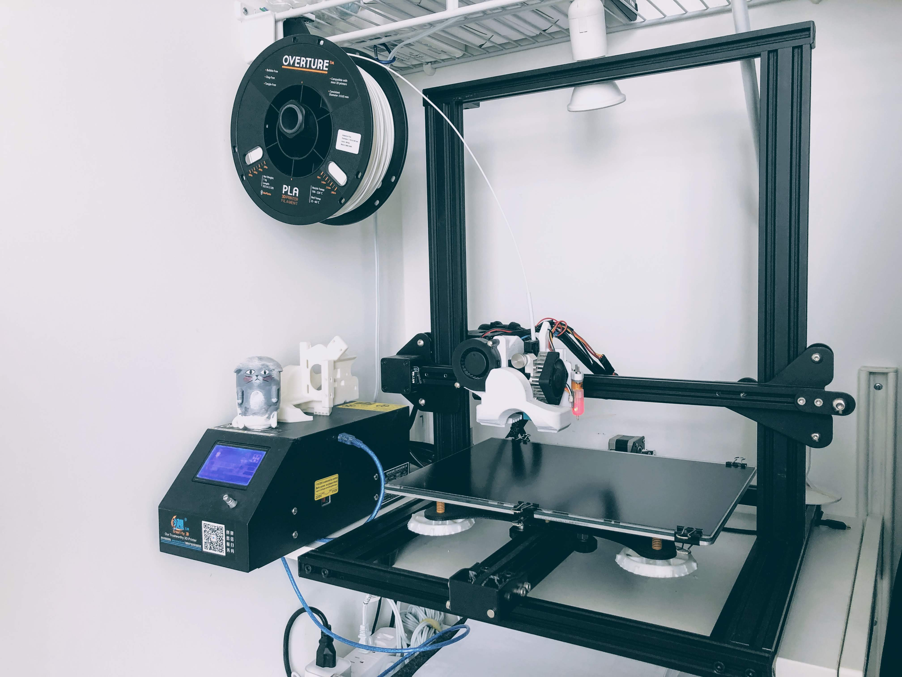
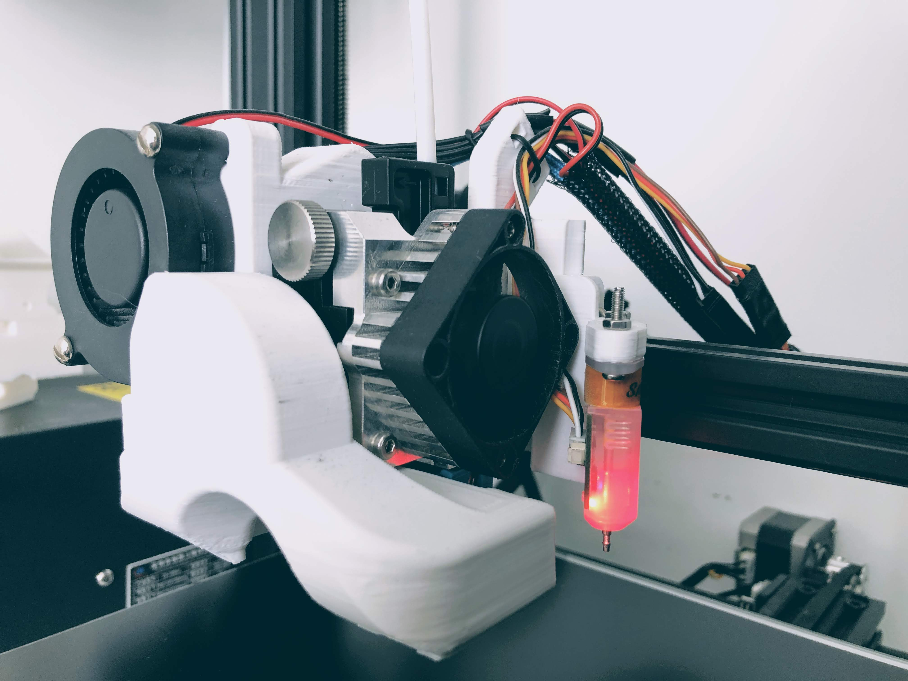

# 3DPrint
My current setup, firmware, and software setup for 3D printing with the CR-10 mini.

# Setup

* [Creality CR-10 Mini](https://www.banggood.com/Creality-3D-CR-10-Mini-DIY-3D-Printer-Kit-Support-Resume-Print-300220300mm-Large-Printing-Size-p-1201287.html?cur_warehouse=USA) - with 300w x 220d x 300h build volume
* [Titan Aero Extruder](https://e3d-online.com/titan-aero) - upgrade to direct-drive extruder
* 0.4mm Brass Nozzle - general, all-purpose nozzle
* [BLTouch probe](https://www.antclabs.com/bltouch) - for auto bed-leveling
* [Titan Aero Evolve](https://www.thingiverse.com/thing:3279302) - extruder mount with great cooling
* [Printbite Build Platform](https://flex3drive.com/product/printbite/) - durable and great performance print surface
* [RaspberryPi + OctoPrint](https://octoprint.org/) - remote print control
* 1.75mm PLA Filament - I like eSun and Hatchbox, but currently on a roll of Overture (and liking that, too)

Close up of the head setup.  

# Firmware

The printer has been flashed with [Marlin Firmware](https://marlinfw.org/) (v1.1.9) using TH3D's Arduino IDE from their [Unified Firmware Package](https://www.th3dstudio.com/knowledgebase/th3d-unified-firmware-package/).

Configurations for Marlin (v1.1.9) have been tuned in the [Configuration.h](3DPrint/Marlin_1.1.9/Configuration.h) file.

# Software

For modeling, I use primarily [Rhinoceros](https://www.rhino3d.com/), from my years of Architecture modeling.  I'm on v5, though v6 has been out for a while.

For slicing (preparing the files to print), I use [Ultimaker Cura](https://ultimaker.com/software/ultimaker-cura), mainly with [this profile](Cura/Profile/) for PLA at 0.2mm layer heights.
